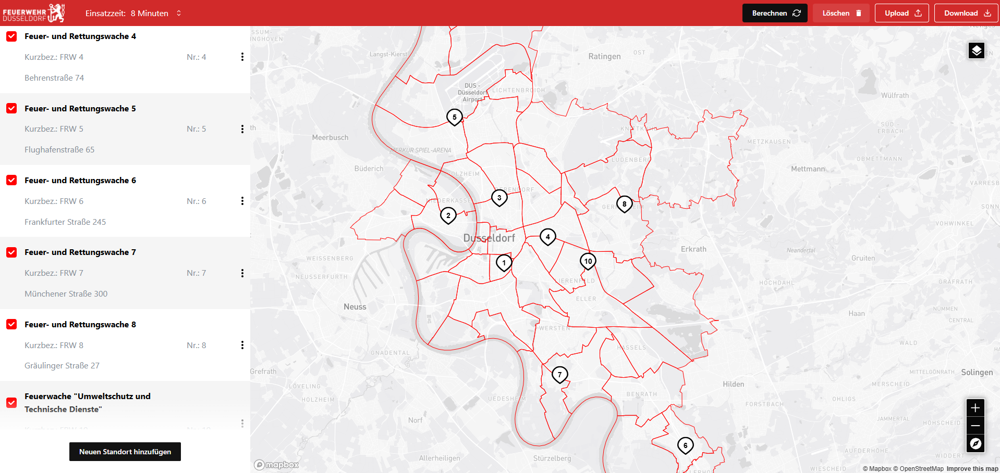

# Feuerwehr Standortplanungstool

Dieses Tool ermöglicht die digitale Planung und Optimierung von Feuerwehrstandorten. Es bietet eine interaktive Karte zur Visualisierung von Standorten, eine Sidebar zur Verwaltung und Bearbeitung sowie eine intuitive Benutzeroberfläche zur schnellen Anpassung und Optimierung der Standortverteilung.

## Funktionen
- **Kartenintegration mit Mapbox**: Standorte werden auf einer interaktiven Karte dargestellt.
- **Dynamische Standortverwaltung**: Hinzufügen, Bearbeiten und Löschen von Standorten in Echtzeit.
- **Adress- und Positionsaktualisierung**: Automatische Anpassung der Marker basierend auf Adressänderungen.
- **Statusverwaltung**: Möglichkeit, Standorte zu aktivieren oder zu deaktivieren.
- **Benutzerfreundliche Oberfläche**: Schnelle und einfache Bedienung für eine optimierte Standortplanung.

## Technologie-Stack
- **React** mit TypeScript
- **Redux** für das State-Management
- **Mapbox GL** für die Kartenvisualisierung
- **Mantine UI** für eine moderne Benutzeroberfläche

Dieses Tool hilft dabei, Feuerwehrstandorte effizient zu verwalten und die Einsatzplanung zu optimieren.

## Preview

