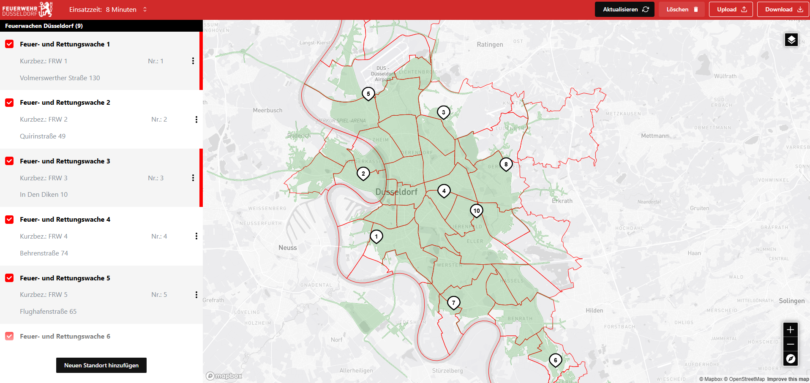

# Feuerwehr Standortplanungstool

Dieses Tool ermöglicht die digitale Planung und Optimierung von Feuerwehrstandorten. Es bietet eine interaktive Karte zur Visualisierung von Standorten, eine Sidebar zur Verwaltung und Bearbeitung sowie eine intuitive Benutzeroberfläche zur schnellen Anpassung und Optimierung der Standortverteilung.

## Funktionen
- **Kartenintegration mit Mapbox**: Standorte werden auf einer interaktiven Karte dargestellt.
- **Dynamische Standortverwaltung**: Hinzufügen, Bearbeiten und Löschen von Standorten in Echtzeit.
- **Adress- und Positionsaktualisierung**: Automatische Anpassung der Marker basierend auf Adressänderungen.
- **Statusverwaltung**: Möglichkeit, Standorte zu aktivieren oder zu deaktivieren.
- **Benutzerfreundliche Oberfläche**: Schnelle und einfache Bedienung für eine optimierte Standortplanung.

## Technologie-Stack
- **React** mit TypeScript
- **Redux** für das State-Management
- **Mapbox GL** für die Kartenvisualisierung
- **Mantine UI** für eine moderne Benutzeroberfläche

Dieses Tool hilft dabei, Feuerwehrstandorte effizient zu verwalten und die Einsatzplanung zu optimieren.

## Preview

Standorte verteilen – Platziere Feuerwehrstandorte auf der Karte, entweder durch Drag & Drop oder durch direkte Adresseingabe in der Sidebar. So können neue Standorte flexibel hinzugefügt oder bestehende angepasst werden.

Erreichbarkeiten berechnen – Erhalte eine visuelle Darstellung der Gebiete, die von den ausgewählten Feuerwehrstandorten innerhalb einer bestimmten Zeitspanne erreicht werden können. Dies hilft bei der Einschätzung der Abdeckung.

Standorte dynamisch anpassen – Verschiebe Standorte per Drag & Drop oder ändere die Adressen in der Sidebar. Hier wurden beispielhaft FRW 1 und FRW 3 verändert, was sich auf die Erreichbarkeiten auswirkt.

Erreichbarkeiten aktualisieren – Nach Anpassungen der Standorte lassen sich die neuen Erreichbarkeiten berechnen, um die Auswirkungen auf die Einsatzplanung direkt zu sehen.

Unterschiedliche Einsatzzeiten simulieren – Wähle verschiedene Zeitvorgaben für die Anfahrt aus und berechne die Erreichbarkeiten für unterschiedliche Einsatzszenarien, um die optimale Standortverteilung zu ermitteln.

  
(Dieses Projekt wurde inspiriert durch das Standortplanungstool von  
<a href="https://ubilabs.com/de/insights/standortplanungstool-feuerwehr-duesseldorf" target="_blank">Ubilabs</a>.  
Es wurde jedoch unabhängig entwickelt und steht in keiner Verbindung zu Ubilabs oder der Feuerwehr Düsseldorf.  
Es handelt sich nicht um eine offizielle Anwendung der Feuerwehr Düsseldorf.)  
